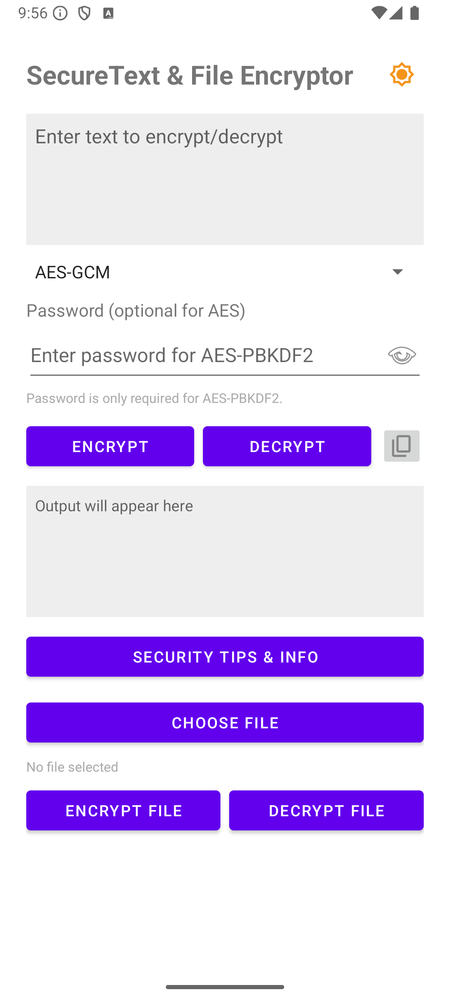
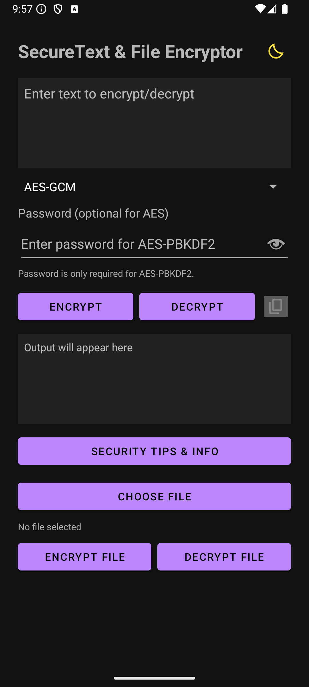

# 🔐 CipherGuard

<p align="center">
  
  
  
  
  
</p>

## 🖼️ Screenshots

<p align="center">
  
  
</p>

**CipherGuard** is a modern Android encryption application providing secure text and file encryption with enterprise-grade security features. Built with Material Design 3 and Android KeyStore integration for hardware-backed security.

---

## ✨ Features

### 🔒 **Encryption Algorithms**
- **AES-GCM (256-bit)**: Authenticated encryption with data integrity
- **AES-CBC (256-bit)**: Traditional AES encryption with PKCS7 padding
- **RSA-OAEP (2048-bit)**: Hybrid encryption for large files
- **AES-PBKDF2**: Password-based encryption with 100,000 iterations

### 🛡️ **Security Features**
- **Android KeyStore**: Hardware-backed key security
- **Secure Random Generation**: Cryptographically secure IV and salt generation
- **Memory Protection**: Secure data cleanup
- **No Key Storage**: Keys stored only in Android KeyStore

### 📱 **User Experience**
- **Material Design 3**: Modern responsive interface with theme support
- **File Support**: Encrypt/decrypt any file type with format preservation
- **Clipboard Integration**: Easy copy/paste functionality
- **Real-time Feedback**: Progress updates and error messages

---

## 🏗️ Technical Architecture

**Core Components:**
- **MainActivity.java**: UI controller and encryption orchestration
- **CryptoUtils.java**: Cryptographic operations library
- **Android KeyStore**: Secure hardware-backed key management

**Security Standards:**
- AES-256, RSA-2048 encryption
- SecureRandom for cryptographic parameters
- PBKDF2 with 100,000 iterations
- GCM authentication tags

---

## ⚙️ How It Works

1. **Select Algorithm**: Choose from AES-GCM, AES-CBC, RSA-OAEP, or AES-PBKDF2
2. **Input Data**: Enter text or select file for encryption/decryption
3. **Process**: Secure cryptographic operations with Android KeyStore
4. **Output**: Results displayed with copy-to-clipboard functionality

**Key Features:**
- Hardware-backed key storage
- Automatic file naming with `_encrypted`/`_decrypted` suffixes
- MIME type preservation for files
- Built-in security tips and error handling

---

## 🚀 Getting Started

**Prerequisites:**
- Android Studio (Latest Version)
- Java 11+
- Android SDK API 29+ (Android 10+)

**Installation:**
```bash
git clone https://github.com/ADITYA-SHAKYA04/CipherGuard.git
cd CipherGuard
# Open in Android Studio and run
```

**Dependencies:**
- AndroidX AppCompat 1.7.1
- Material Components 1.12.0
- Target SDK: 36, Min SDK: 29

---

## 📋 Technical Specifications

| Component | Details |
|-----------|---------|
| **Language** | Java 11 |
| **UI Framework** | Material Design 3 |
| **Encryption** | AES-256, RSA-2048, PBKDF2 |
| **Key Management** | Android KeyStore |
| **Compatibility** | Android 10+ (API 29+) |

---

## 🔐 Encryption Algorithms

- **AES-GCM**: 256-bit, authenticated encryption (recommended)
- **AES-CBC**: 256-bit with PKCS7 padding  
- **RSA-OAEP**: 2048-bit hybrid encryption for large files
- **AES-PBKDF2**: Password-based with 100,000 iterations

## 🛡️ Security Features

- ✅ Hardware-backed Android KeyStore
- ✅ Cryptographically secure random generation
- ✅ No hardcoded keys or credentials
- ✅ Memory protection and secure cleanup
- ✅ Industry-standard encryption parameters

---

## 🤝 Contributing

Contributions are welcome! Please:
1. Fork the repository
2. Create a feature branch
3. Follow Android coding standards
4. Test thoroughly on Android 10+
5. Submit a pull request

## 📄 License

MIT License - see [LICENSE](LICENSE) file for details.


## ⭐ Show Your Support

<div align="center">

**If you found CipherGuard helpful, please consider:**

[](https://github.com/ADITYA-SHAKYA04/CipherGuard/stargazers)
[](https://github.com/ADITYA-SHAKYA04/CipherGuard/network/members)
[](https://github.com/ADITYA-SHAKYA04/CipherGuard/issues)

**⭐ Star this repository if it helped you!**  
**🐛 Report bugs or suggest features via [Issues](https://github.com/ADITYA-SHAKYA04/CipherGuard/issues)**  
**🔄 Share with fellow developers interested in Android Security**

</div>

---

<div align="center">

## 🔐 Security Notice

**CipherGuard implements industry-standard encryption algorithms and follows Android security best practices. However, no security system is perfect. Always:**
</div>

---

<div align="center">

### 🛡️ **Built with ❤️ for Android Security & Privacy** 🛡️

<sub>© 2024 Aditya Shakya. Distributed under MIT License.</sub>

</div>

